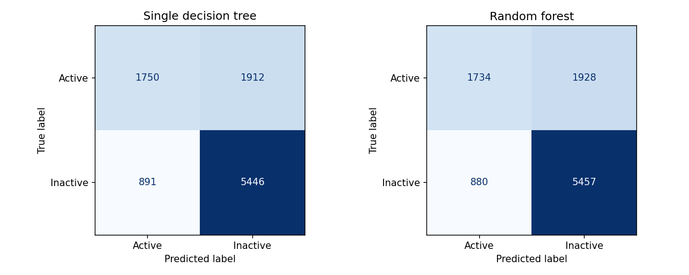

# Rider inactivity forecast: random forest versus decision tree

**Result:** The random forest has a slightly higher held-out ROC AUC (**0.7574 versus 0.7558**) and average precision (**0.8307 versus 0.8264**). The ROC AUC gain is only **0.0017**. At a 0.5 threshold it detects 11 additional inactive riders, while incorrectly flagging 16 additional active riders. The simpler tree is nearly as useful for this exercise.

## Dataset and prediction task

- **Source:** [Public `attributes.json` rider challenge dataset](https://github.com/hsivasub/Uber-Rider-Churn-Prediction/blob/760192ed7ace0975bc273c8ef5ac596132439352/attributes.json), with [field descriptions in the source notebook](https://github.com/hsivasub/Uber-Rider-Churn-Prediction/blob/760192ed7ace0975bc273c8ef5ac596132439352/Uber%20Rider%20Churn%20Prediction.ipynb). The code pins the source commit and verifies SHA-256 `8197ac13ee1313d71fcd771a62c0080ee451adf3624b968108ad3cb3d7bc0e66`.
- **Size:** 50,000 records, of which eight exactly duplicate another full record. The analysis uses 49,992 rows after removing those duplicates. There is no rider ID to verify identities.
- **Forecast made:** 30 days after each rider's January 2014 signup.
- **Outcome:** No observed trip from **June 2 to July 1, 2014**, inclusive. This is a **30-day inactivity proxy**, not a confirmed permanent churn or account closure. Its rate is **63.37%**.
- **Predictors:** trips in the first 30 days, signup city, phone type, and signup day of the month. The phone field is assumed to have been available by day 30; its exact timestamp is undocumented.

The source uses fictional city names, including King's Landing and Winterfell. **Its original provenance and license are not established.** These scores describe this public exercise dataset, not verified Uber customers or a deployable churn system. The raw dataset is linked rather than redistributed here.

### Data-quality and leakage decisions

`last_trip_date` determines the answer and is excluded from features. Lifetime ratings, surge, and weekday averages are also excluded because the source describes them across **all** trips; they could contain activity after the first-month prediction point.

Two fields described as first-month fields contradict the recorded first-month trip count: **15,334** riders have zero first-month trips but a positive `avg_dist`, and **5,379** have zero first-month trips but `upgraded_user=True`. Both fields are excluded from both models. This preserves all other riders rather than dropping a selected 31% of the dataset. The significance of `phone` should also be retested if its collection time can be confirmed.

## Method

Both algorithms use the **same stratified 39,993-row training / 9,999-row held-out test split**, random seed 42. The training data alone is used for 3-fold stratified cross-validation and grid search by ROC AUC. Numeric imputation and categorical one-hot encoding occur inside the cross-validation pipelines. Both models use a **0.5 probability threshold** for the classification scores below; that threshold was not tuned on the test set.

| Model | Selected depth | Minimum leaf | Additional selection | Training CV ROC AUC |
| --- | ---: | ---: | --- | ---: |
| Decision tree | 8 | 200 | — | 0.7571 |
| Random forest | 6 | 100 | 120 trees; `max_features=0.8` | 0.7587 |

## Held-out results

The positive class is **inactive**. Average precision is the area under the precision–recall curve; the majority-rate baseline has average precision equal to the held-out inactivity rate.

| Model | ROC AUC ↑ | Average precision ↑ | Precision ↑ | Recall ↑ | F1 ↑ | Brier score ↓ |
| --- | ---: | ---: | ---: | ---: | ---: | ---: |
| Majority-rate baseline | 0.5000 | 0.6338 | 0.6338 | 1.0000 | 0.7758 | 0.2321 |
| Single decision tree | 0.7558 | 0.8264 | 0.7401 | 0.8594 | 0.7953 | 0.1881 |
| Random forest | **0.7574** | **0.8307** | 0.7389 | **0.8611** | **0.7954** | **0.1877** |

The forest-minus-tree ROC AUC difference is **+0.0017**, with a **paired bootstrap 95% interval of +0.0003 to +0.0032** on 300 resamples of these same test riders. This interval describes test-sample variation; it does not address temporal drift or uncertain dataset provenance. The practical improvement is very small.

| Actual class, out of 9,999 riders | Tree: predicted active | Tree: predicted inactive | Forest: predicted active | Forest: predicted inactive |
| --- | ---: | ---: | ---: | ---: |
| Active (3,662) | 1,750 | 1,912 | 1,734 | 1,928 |
| Inactive (6,337) | 891 | 5,446 | 880 | 5,457 |

**Decision cost matters:** At the default threshold the forest flags **1,928 of 3,662 active riders (52.6%)** as inactive. A retention campaign would need a threshold chosen for its budget and false-positive cost, using a separate validation sample. Do not treat the default 0.5 threshold as an operational policy.

## What drives the predictions?

Permutation importance on the untouched test data measures mean ROC AUC decrease when one original feature is shuffled five times:

| Feature | ROC AUC decrease |
| --- | ---: |
| Signup city | 0.0914 |
| Trips in first 30 days | 0.0843 |
| Phone type | 0.0663 |
| Signup day | 0.0040 |

The single tree starts with a city split, followed by early trip count or phone type. These are **predictive associations in a fictionalized dataset**, not proof that a city or device causes churn. See the [top three levels of the tree](assets/decision_tree_top_levels.png).

## Conclusion and next step

The random forest ranks riders **marginally** better, while the tree offers almost the same performance with understandable rules. The trained forest is saved in [`assets/random_forest_churn.joblib`](assets/random_forest_churn.joblib), and the exact metrics in [`assets/results.json`](assets/results.json). For a real ride-hailing use case, collect timestamped first-month features, identify riders consistently, define the intervention horizon and churn window, and validate on a **later cohort** before acting on any score.
